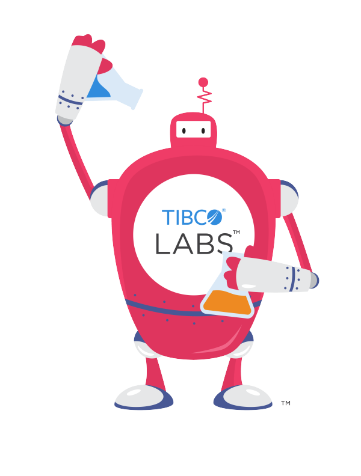

# Welcome to TIBCO LABS™

## Overview

|      |      |
| ---- | ---- |
|  | TIBCO LABS™ is a program designed to provide customers and partners with a mechanism for actively participating in TIBCO’s history of innovation. TIBCO has always been at the forefront of innovation, and TIBCO LABS™ allows participants to share in this history by collaboratively building solutions to today’s challenging problems, previewing new capabilities, and accessing emerging technologies in areas such as blockchain, AI / ML and IoT. Through TIBCO LABS™, customers and partners can gain insight into TIBCO’s innovation activities, participate in shaping the form of these activities in the years to come, and benefit from TIBCO’s leadership position in integration and analytics. |

<b>TIBCO LABS™ Projects - NEW Innovation Projects to inspire you!</b> 
For more details on how you can participate in TIBCO LABS™ , please reach out to your TIBCO representative, and check out the projects below.

> We have currently all our content here on [TIBCO Community - TIBCO Labs Wiki](https://community.tibco.com/wiki/tibco-labs "view in TIBCO Community Wiki")

### AutoML
Automated Machine Learning for business analysts and data scientists  
- [__AutoML for TIBCO Data Science__](https://community.tibco.com/modules/automl-tibcor-data-science-team-studio)

### Discover
A Process Mining solution built on the TIBCOⓇ Connected Intelligence platform.  
- [__Project Discover™__](https://community.tibco.com/modules/project-discover)

### TIBCO Cloud™ Starters Toolkit - for Angular.IO Developers
Documentation Site of all TIBCO Cloud™ Starters Toolkit Repositories on GitHub.  
- [__TIBCO Cloud™ Starters Toolkit__](https://tibcosoftware.github.io/TCSToolkit/) 
TIBCO Cloud Live Apps Case Manager App, containing all core and essential Case Management Features to create more advanced applications.
- [__TIBCO Cloud™ Starters Toolkit - Case Manager App__](https://tibcosoftware.github.io/TCSToolkit/Angular/starters/readme/)

### TIBCO Cloud™ Starters 
Quickstart Apps based on TIBCO Cloud™ Products.  
- [__TIBCO Cloud™ My Partner App__](https://community.tibco.com/modules/tibco-cloud-my-partner-app) 
- [__TIBCO Cloud™ Risk Investigation App__](https://community.tibco.com/modules/tibco-cloud-risk-investigation-app)
Both Apps are highly reusable for different business purposes. (Closed Code)
 
### Blockchain 
Innovation Projects Looking at the World of Distributed Ledgers and Smart Contracts  
- [__Project Dovetail™__](https://community.tibco.com/modules/project-dovetail)
 
### Chatbots/Conversational UIs
Looking at Having a Conversation with Your Data  
- [__Project Cloud Conversations__](https://community.tibco.com/modules/project-cloud-conversations)
 
### More to come...
...we have many innovation ideas in our back pocket!  Be sure to subscribe to updates and check us out regularly!  :)

